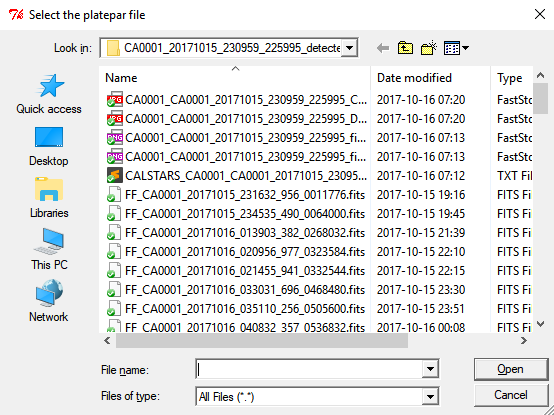
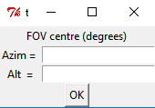

# Creating an initial astrometric plate with SkyFit

After collecting your first night of data, and assuming the night was clear, you will have your first detected meteors, congrats!

Now, the next very important step is to create an astrometric plate. An astrometric plate is just a file which tells our software how to convert the positions of meteors from image coordinate (X and Y) to sky coordinates (right ascension and declination). This step is very important because these coordinates are used to estimate meteor trajectories, and in the end, calculate the orbit of the meteor.

The way to do this is to match the positions of the stars on images to their positions from the star catalog. Once this transformation is known, we can convert any image coordinates to the coordinates on the sky.


#### 1. Configuration

First, we need to make sure that the values in the configuration file are correct. Locate and open the ```.config``` configuration file, which is in the RMS root directory (probably ```~/RMS```). 

Under the section [System] configure the geographical location of your camera, you can either look up the values on (http://elevationmap.net) or use a GPS app on your phone:

- latitude - Latitude of your camera in decimal degrees, North latitudes are positive.
- longitude - Longitude of your camera, eastern longitudes are positive. NOTE: If you live West of the prime meridian, i.e. Western Europe, North or South America, your longitudes will be nagative!
- elevation - Altitude above sea level in meters.

Under the section [Capture], configure an approximate field of view (FOV) of your camera:

- fov_w - Width of the camera's field of view in degrees.
- fov_h - Height of the camera's field of view in degrees.

If you are using a camera with a 1/3" sensor, here are some typical values of the field of view per different lenses (lens focal length - FOV width x FOV height)

- 2.8mm lens - 91x68 deg
- 4mm lens - 64x48 deg
- 6mm lens - 42x32 deg
- 12mm lens - 21x16 deg
- 25mm lens - 10x7 deg

If you are using a different lens or a sensor, you can calculate the field of view with the following formula: 

*FOV = 2\*arctan(d/(2\*f))* 

where *d* is the size of the sensor in the given directon (width or height), and *f* is the focal length of the lens.

For example, a 1/2" sensor has a width of 6.4mm, and when coupled with a 4mm lens its FOV width will be about 77 degrees. Its height is 4.8mm and it has a FOV height of around 62 degrees with the same lens.


#### 2. Locating the night folder

The second thing to do is to find one night with clear periods and (possibly) with some meteor detections. All data recorded by the RMS software will be stored in ```~/RMS_data```. We recommend that you use [CMN binViewer](https://github.com/CroatianMeteorNetwork/cmn_binviewer/) to view the data first.

In this example, the image files are located in ```~/RMS_data/ArchivedFiles/CA0001_20171015_230959_225995_detected```.


#### 3. Run SkyFit

Use the terminal to navigate to your root RMS directory (most probably ```~/RMS```) and from there run:

```
python -m RMS.Astrometry.SkyFit path/to/night/directory
```

where ```path/to/night/directory``` is the location of the image files determined in the previous step, in this case ```~/RMS_data/ArchivedFiles/CA0001_20171015_230959_225995_detected```

A file dialog will pop out, asking you to open an exiting platepar file. As we don't have a platepar yet, press 'Cancel'.




Next, a dialog asking you to input an approximate azimuth and altitude of the camera's field of view will appear:



**Azim**uth is the angle between due North and the centre of the field of view of your camera - it is very important that you first face North and then measure the angle towards the East. For example, if your camera is pointing North-East, the azimuth is 45°. On the other hand, if your camera is pointing South-West, the azimuth is 225°.

**Alt**itude is the angle between the horizon and the centre of the field of view of the camera. If you have pointed your camera straight up, towards the zenith, the altitude will then be around 90°, but the azimuth then loses meaning and can be any angle between 0 and 360.


#### 4. 
