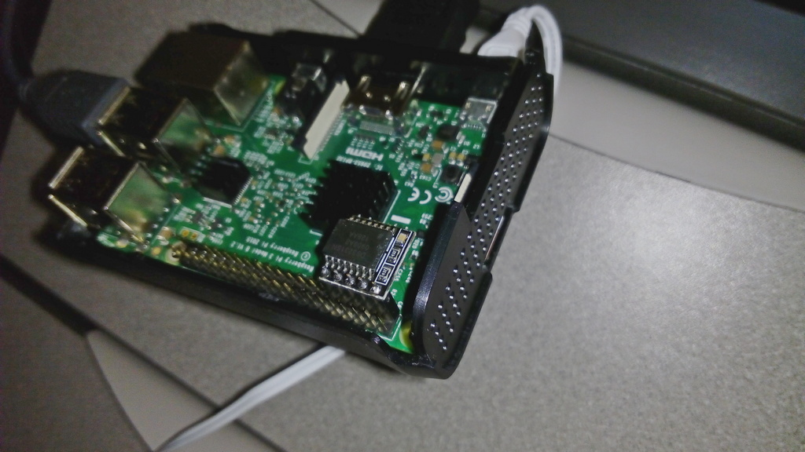

# Setting up the RTC module for use with Raspberry Pi 3

## Hardware
You will need:

* Raspberry Pi 3 with Raspbian Jessie
* [DS3231 RTC module](https://www.aliexpress.com/item/1pc-DS3231-Precision-RTC-Module-Memory-Module-for-Arduino-Raspberry-Pi/32676041749.html)

Connect the RTC module to the GPIO according to this image:


## Software setup

#### 0. Note on editing files: Every time this guide tells you to edit a file, do it with:
```
sudo nano <file_name>
```
where you will replace `<file_name>` with the name of the file. After you are done, press `Ctrl + X` and press `y` when it asks you if you want to save changes.

#### 1. Add the following lines at the end of `/boot/config.txt` in Raspbian Jessy:
```
dtparam=i2c_arm=on
dtoverlay=i2c-rtc,ds3231
```

Reboot your Raspberry Pi:

```
sudo reboot
```

#### 2. We don’t need fake-hwclock module anymore, so we are going to remove it:
```
sudo apt-get remove fake-hwclock
sudo update-rc.d hwclock.sh enable
sudo update-rc.d fake-hwclock remove
```
This module was used to store the current time to the SD card when the RPi was turned off, and it would load that time from the SD card during boot. Now that you have a real clock, you don't need it anymore.

#### 3. Modify the file `/lib/udev/hwclock-set` by commenting out lines with `–systz`:
```
if [ yes = “$BADYEAR” ] ; then
    #/sbin/hwclock –rtc=$dev –systz –badyear
    /sbin/hwclock –rtc=$dev –hctosys –badyear
else
    #/sbin/hwclock –rtc=$dev –systz
    /sbin/hwclock –rtc=$dev –hctosys
fi
```

#### 4. Set the current system time and write the system time to the RTC module using:
```
sudo hwclock -w
```

#### 5. Set the correct time zone using:
```
sudo dpkg-reconfigure tzdata
```

#### 6. Get rid of the NTP daemon as well using:
```
sudo apt-get remove ntp
sudo apt-get install ntpdate
```
The NTP daemon tended to corrupt the time on the RTC, so we have to remove it.
After the NTP daemon has been removed, you can still sync the system clock using `ntpdate-debian` which you might add to /etc/rc.local as well (after the hwclock command though) – just in case there is an Internet connection available during boot.

#### 7. Edit /etc/rc.local and add the hwclock command above the line that says `exit 0`:
```
sleep 1
hwclock -s
ntpdate-debian
```
This will read in the time from the RTC upon boot, and sync the time via Internet (if it is available).

#### 8. The `/etc/init.d/hwclock.sh` shell scripts tends to corrupt this RTC clock module. In my case, the RTC clock was set to 2066/01/01 after every reboot. To prevent this from happening, edit `/etc/default/hwclock` and set `HWCLOCKACCESS` to no:
```
HWCLOCKACCESS=no
```

#### 9. There is already a systemd task for updating the RTC from the system clock during power-off or rebooting. 
Edit `/lib/systemd/system/hwclock-save.service` and comment out this line: 
```
ConditionFileIsExecutable=!/usr/sbin/ntpd
```

#### 10. You should make sure the hwclock.save.service is enabled by running: 
```
sudo systemctl enable hwclock-save.service
```

#### 11. To update the time via the Internet every 15 minutes, do this:
Run:
```
crontab -e
```

and add this line at the end:
```
*/15 * * * * ntpdate-debian >/dev/null 2>&1
```

#### 12. Reboot.
Done! Raspbian will now set the time from the RTC clock during boot even if there is no Internet connectivity available.
